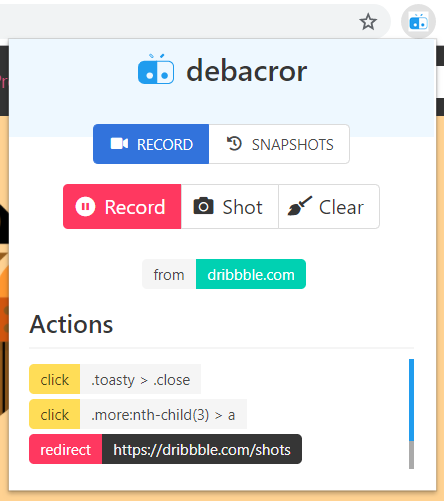

## debacror

> Debuggable Action Recorder

### Status

> we will release the beta version soon in a few days.

---

Debacror is a web automation tool for developer. We want to design a debuggable action-record tool that fully depends on browser environment, and totally controllable like the native devtools. You can choose and edit the action flow to execute, and combine actions as you want.

Contribution is much appreciated. For more information about contribution, please refer to `CONTRIBUTING.md` and `CODE_OF_CONDUCT.md`
